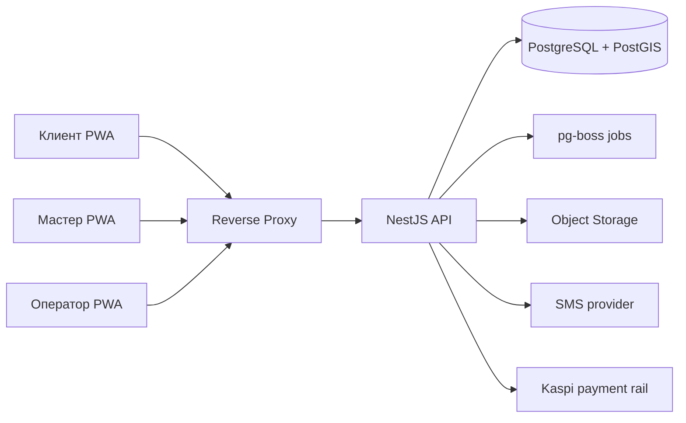
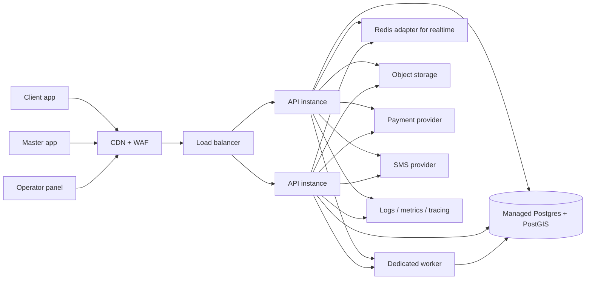
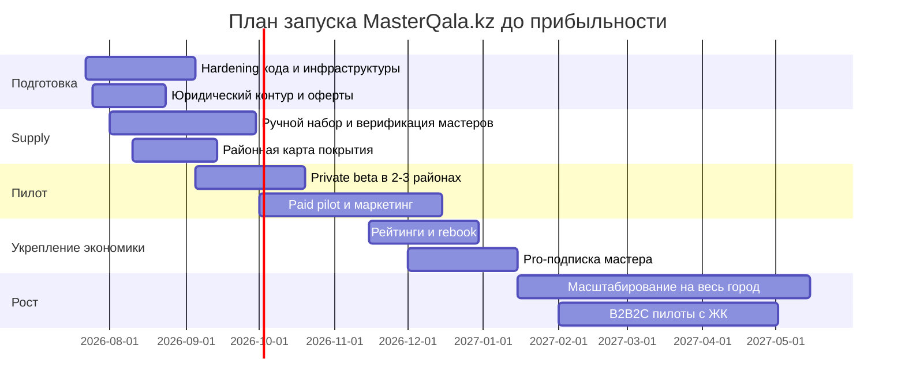

# Аналитический отчёт по проекту MasterQala.kz

> **Замороженный снимок на 19.07.2026 — не редактируется.**
>
> Извлечено из JSON-дампа сессии исследования, который лежал в `docs/` как
> нечитаемый машинный артефакт. Текст отчёта сохранён полностью; удалены только
> служебные маркеры цитирования. Утверждения не проверялись при извлечении.
>
> Источников в исходной сессии: 281 (доменов: 109) — перечень в конце.
> Актуальное состояние кода — в [STATUS.md](../STATUS.md).

---

## Executive summary

По содержанию репозитория **MasterQala.kz** — это не marketplace недвижимости, а **двусторонняя платформа бытовых услуг на дом** для Казахстана: срочный вызов мастера “как такси” и плановая заявка “как биржа откликов”. Это следует из README, проектной спецификации и структуры кода: клиент создаёт срочную или плановую заявку, мастер проходит онбординг и верификацию, платформа считает стоимость выезда, матчингует мастеров по радиусу, поддерживает споры, lead-кредиты, кошелёк и операторские сценарии.

Моя итоговая оценка: **проект может “выстрелить” в Казахстане на уровне одного-двух городов, если его запускать как узкий vertical marketplace для аварийных и бытовых работ**, а не как “ещё одну доску объявлений”. Вероятность построить **устойчивый городской бизнес** я оцениваю как **среднюю**, а шанс быстро стать общенациональным лидером “из коробки” — как **ниже среднего**. Причина в том, что в коде уже есть сильная доменная модель и покрытие критических процессов, но продакшен-готовность, реальная платёжная интеграция, удержание исполнителей, доверие пользователей и supply-side operations пока выглядят недозавершёнными.

Рынок для такого продукта в Казахстане **есть**. На 1 июня 2026 года в стране было 20,6 млн жителей, из них 13,17 млн — городское население; жилищный фонд по итогам 2025 года составил 447,3 млн кв. м, в стране насчитывалось 2,6 млн жилых домов, включая около 299,6 тыс. многоквартирных домов и 6,2 млн квартир. Одновременно страна уже глубоко цифровая: по данным DataReportal, интернетом в Казахстане пользовались 19,5 млн человек, а penetration составлял 93,4%; Нацбанк сообщал, что только в мае 2026 года объём безналичных транзакций по картам казахстанских эмитентов достиг 16,2 трлн тенге, а Kaspi указывает на 16 млн клиентов в своём суперприложении. Это означает, что спрос на цифровой сервис домашнего ремонта и экстренного вызова технически поддерживается и инфраструктурно, и потребительски.

Сильнейшая сторона проекта — не дизайн и не стек сами по себе, а **рыночная гипотеза**: платформа не забирает процент с работы мастера, а монетизируется через сервисный сбор за срочный вызов и lead-кредиты за плановые отклики. Это снимает часть сопротивления исполнителей и лучше соответствует “серому” и фрагментированному рынку мастеров, где многие готовы платить за лид, но не любят комиссию с чека. Однако текущая версия monetization stack, скорее всего, **не доведёт бизнес до быстрой прибыльности без третьего доходного слоя**: подписки/приоритета для мастеров, B2B/B2B2C-контрактов с ЖК/управляющими компаниями или гарантийного/сервисного пакета. Этот вывод — моя экономическая интерпретация модели, заложенной в проектной спецификации.

Практический вывод: **запускать можно**, но только через **один город, две категории, два-три района, жёсткий ручной supply-ops и заметную доработку продакшен-блока**. Наиболее реалистичный путь к прибыльности — не “вся страна сразу”, а **Алматы как пилот**, затем Астана как второй город, при одновременном усилении trust layer, платёжной интеграции, удержания мастеров и районной ликвидности. По моему базовому сценарию, до положительного операционного результата проект можно довести примерно за **12–18 месяцев**, если команда дисциплинированно удержит фокус на одной вертикали, одном городе и не будет расползаться по десяткам услуг. Это уже вывод на основе репозитория, рынка и предлагаемых ниже допущений.

## Что это за проект и насколько он может выстрелить

### Что проект делает на самом деле

Судя по README и спецификации, продукт решает типичную городскую проблему: когда у клиента “течёт, искрит, не работает, заклинило”, ему нужен не каталог абстрактных подрядчиков, а **быстрый, понятный и относительно безопасный способ найти свободного мастера рядом**. В проекте это реализовано в двух режимах. Первый — срочный вызов, где система заранее рассчитывает выезд, рассылает оффер ближайшим мастерам волнами и отдаёт заявку первому принявшему. Второй — плановый режим, где клиент публикует задачу, а мастера откликаются ставками за lead-кредиты.

Это важное рыночное различие. **OLX, Kaspi Объявления, 2GIS и частично Yandex Услуги** в Казахстане в основном решают задачу поиска и контакта, но не задачу гарантированного выезда, real-time статусов, управляемой очереди, удержаний при отмене, споров и специализированной логики аварийного вызова. В этом и есть окно возможностей MasterQala: если продукт реально обеспечивает предсказуемый SLA и контроль качества в узких категориях, он становится не “доской”, а **операционным сервисом**.

### Итоговая оценка шансов

Ниже — моя сводная оценка проекта по состоянию на анализ репозитория и рынка.

| Параметр | Оценка | Комментарий |
|---|---:|---|
| Сила проблемы | 8/10 | Срочный сантехник/электрик/замочник — частая и болезненная проблема в городах |
| Продуктовая гипотеза | 8/10 | Двухрежимная модель “сейчас + планово” удачна и близка к реальному поведению пользователей |
| Технический MVP | 7/10 | Для MVP код зрелее среднего: есть state-machine, realtime, e2e, wallet, disputes |
| Продакшен-готовность | 5/10 | Нет реального payment rail, есть mock provider, локальное хранение файлов, видимых CI/CD не видно |
| Рыночная готовность | 5/10 | Нет публичных сигналов traction: 0 stars/forks/issues, нет продуктовых метрик, no public validation |
| Шанс выстрелить в одном городе | 7/10 | Реалистично при узком фокусе и ручном supply-ops |
| Шанс быстро масштабироваться на весь Казахстан | 4/10 | Слишком зависит от локальной ликвидности, trust layer и операционной дисциплины |

Оценка “рыночной готовности” занижена не потому, что идея плохая, а потому что репозиторий пока выглядит как **хорошо продуманный product prototype / MVP foundation**, а не как сервис, который уже прошёл жёсткую проверку продом и каналами роста. У репозитория публично видно 0 stars, 0 forks и 0 issues, а последние коммиты от 17 июля 2026 года в основном связаны с редизайном web-интерфейса и выносом UI-компонентов, что говорит о продолжающейся активной разработке, но не о подтверждённом market pull.

### Где именно есть шанс на рывок

У проекта высокий шанс занять нишу, если он будет позиционироваться так:

1. **не “найди мастера”**, а **“вызови проверенного мастера сейчас”**;
2. **не “сразу все категории”**, а **две аварийные категории плюс одна плановая**;
3. **не “весь Казахстан”**, а **только один город и только районы, где есть supply liquidity**;
4. **не “приложение ради приложения”**, а **service layer поверх реальной операционной службы**.

Казахстанский рынок уже готов к цифровой оплате и app-based behavior: страна имеет высокую интернет-проницаемость, очень большой объём безналичных платежей и мощную привычку населения к Kaspi как к базовому цифровому слою. Поэтому проблема не в обучении рынка пользоваться сервисом, а в том, сумеет ли сервис обещать и выполнять **доверие, скорость и понятную цену**. Это скорее операционный, чем технологический вызов.

## Аудит репозитория и техническая готовность

### Что видно по структуре и стеку

Репозиторий — это **pnpm monorepo** с корневым package manager, двумя основными приложениями и отдельным пакетом UI-компонентов. В корне указаны `pnpm@9.15.0`, а в структуре видны `apps/api`, `apps/web` и `packages/ui`. README прямо описывает monorepo как API на NestJS + Prisma + PostgreSQL и web на Vite + React PWA. В последних коммитах также видно, что UI вынесен в отдельный пакет `@masterqala/ui`.

Backend построен на **NestJS 10**, Prisma и PostgreSQL/PostGIS; для realtime используется `socket.io`, для фоновых задач — `pg-boss`. В `AppModule` подключены доменные модули `auth`, `users`, `masters`, `admin`, `payments`, `routing`, `pricing`, `queue`, `realtime`, `lead-credits`, `orders`, `planned-orders`, `wallet`, `disputes`. Это не “тонкий CRUD”; это уже явная доменная архитектура сервиса с отделёнными bounded contexts.

Frontend — это **React 19 + Vite + React Router + React Query + Tailwind 4**, плюс `vite-plugin-pwa`, что указывает на ставку на PWA, а не на нативные мобильные приложения в первой фазе. Для казахстанского рынка это прагматично: входной порог ниже, time-to-market быстрее, а для части сценариев — особенно клиентского — PWA вполне достаточно. Но для мастеров, которым нужны надёжные пуши, фоновые обновления, геолокация и быстрый accept rate, в будущем нативный mobile app почти наверняка даст лучшее качество supply operations.

### Архитектура и доменная модель

Схема Prisma показывает достаточно зрелую доменную модель. Есть сущности для пользователей, профиля мастера, категорий, документов, решений оператора по верификации, срочных заказов, офферов по заказу, присутствия мастера, платежных транзакций, начислений, плановых заказов, ставок, баланса lead-кредитов, покупок lead-кредитов, кошелька мастера, заявок на вывод, споров и штрафов/отмен. Это сильный признак того, что автор уже мыслит проект не как “экран формы + таблица”, а как **управляемую операционную систему сервиса**.

Логика срочного режима подтверждается и спецификацией, и кодом. В спецификации описаны три волны матчинга: 0–3 км, затем 3–6 км, затем 6–10 км с таймаутами 60/60/90 секунд; в коде эти же радиусы и таймауты захардкожены в `order.constants.ts`. В `pricing.service.ts` есть поиск ближайшего свободного мастера, расчёт расстояния и временного коэффициента, а для цены выезда используется формула “база + расстояние × тариф × коэффициент времени”. Это удачная техническая связка между product spec и реализацией: архитектура не расходится с бизнес-идеей.

Для web-интерфейса уже видны основные реальные сценарии. У клиента есть страницы Home, Login, NewOrder, Order, MyOrders, PlannedNewOrder, PlannedOrder, Profile. У мастера — BecomeMaster, Work, LeadCredits, Wallet. У оператора — Admin list/detail, disputes, withdrawals. Причём страница `WorkPage` уже содержит логику полноэкранного оффера, звука, вибрации, таймера, переключения онлайн/офлайн, геолокации, активной заявки и плановой ленты откликов. То есть frontend уже отражает реальные high-intent сценарии рынка.

### Что в проекте уже хорошо

К сильным техническим сторонам я отношу прежде всего **богатое e2e-покрытие**. В каталоге тестов видны сценарии по аутентификации, заказам, отменам, плановым заявкам, lead-кредитам, кошельку, выплатам, матчинг-волнам, realtime, спорам, документам и админским решениям. Для раннего marketplace-а это важнее “красивой архитектуры”, потому что основные риски именно в сложных state transitions и edge-cases.

Вторая сильная сторона — **ручной trust layer**. В проекте предусмотрены документы мастера, статус проверки, операторские решения, споры и санкции. Для Казахстана это выглядит реалистично: рынок мастеров фрагментирован, часть исполнителей может работать без сильной цифровой дисциплины, поэтому ставка на ручной quality gate в MVP — правильнее, чем пытаться всё автоматизировать с первого дня.

Третья сильная сторона — то, что продукт уже содержит модель **дисинтермедиации и анти-увода**: контакты открываются позже, доход в срочном сценарии берётся не с работы, а с выезда, есть отмены, компенсации и приоритетные санкции. В двухсторонних сервисах это одно из самых сложных мест, и в этой части гипотеза продумана лучше, чем у многих ранних marketplace MVP.

### Где продакшен-риски и уязвимости

Продакшен-готовность у проекта пока **средняя или ниже средней**, и это основной технический барьер перед launch.

Во-первых, платёжный слой пока **mock**. В `mock-payment.provider.ts` холд, capture, payout и refund фактически симулируются через записи в БД и генерацию `mock-*` идентификаторов. Это нормально для разработки и e2e, но означает, что самый чувствительный бизнес-контур — сервисный сбор, пополнение lead-кредитов и вывод средств мастеру — в проде пока не существует как надёжная финансовая интеграция. Более того, сама спецификация отдельно подчёркивает, что реальные продукты/лимиты/массовые выплаты Kaspi — внешняя зависимость, требующая отдельных переговоров.

Во-вторых, в проекте видны **dev-oriented настройки безопасности**. В `.env.example` указан `JWT_SECRET="dev-secret-change-me"`, а `main.ts` включает `app.enableCors({ origin: true })`. В сочетании с тем, что web-клиент хранит токен в `localStorage`, это не является “дырой по умолчанию”, но сильно увеличивает требования к XSS-гигиене, CSP, доменной политике и production secret management. Для MVP это допустимо, для боевого запуска с обработкой ИИН, телефонов и документов — уже нет.

В-третьих, проект хранит загруженные документы локально в `UPLOAD_DIR="./uploads"`. При этом в доменной схеме есть ИИН, документы личности и квалификации. Это означает, что для продакшена обязательны как минимум: объектное хранилище, шифрование at rest, отдельная политика retention/deletion, логирование доступа и корректные согласия на обработку персональных данных. Закон Казахстана о персональных данных и их защите прямо регулирует сбор, обработку и защиту персональных данных, а проект работает именно с чувствительными идентификационными данными.

В-четвёртых, в репозитории не видно явного production-grade CI/CD-контура. В корневом дереве нет типичного каталога `.github/workflows`, а README описывает запуск разработки через локальный `docker compose`, `pnpm prisma migrate dev`, `pnpm db seed`, `pnpm start:dev` и `pnpm web dev`. Это не значит, что CI/CD отсутствует вне репозитория, но в публично доступном коде подтверждения production pipeline нет.

В-пятых, инфраструктура пока завязана на **PostGIS + pg-boss + Socket.IO без видимых Redis/Kafka-адаптеров**. Для одного города и одного инстанса это нормально. Для горизонтального масштабирования это создаёт очевидное ограничение: очереди ещё можно временно держать на PostgreSQL, а вот realtime-события при нескольких API-инстансах уже потребуют адаптера шины сообщений и более аккуратной session affinity. Это мой технический вывод из зависимостей и текущей архитектуры.

### Готовность к хостингу и масштабированию

Для **пилота одного города** проект можно собрать на довольно экономной схеме:

Эта схема соответствует репозиторию: один публичный web-клиент/PWA, один API-сервис, один PostgreSQL c PostGIS, фоновые задачи через pg-boss, внешние провайдеры SMS и платежей. Для частного бета-запуска этого достаточно.

Для **масштабирования до нормального городского бизнеса** я бы переводил архитектуру в следующую форму:

Переходить к такой схеме нужно **не сразу**, а после пилота при выполнении трёх условий: fill-rate стабильно выше 60–70%, есть хотя бы несколько сотен активных мастеров, и realtime-канал заметно влияет на конверсию в accept/complete. До этого момента преждевременное “enterprise scaling” только съест деньги. Это уже рекомендация по архитектурной эволюции на основе текущего кода.

### Что нужно улучшить в коде до коммерческого запуска

Ниже — список приоритетных технических улучшений.

| Приоритет | Что сделать | Почему это важно |
|---|---|---|
| P0 | Заменить mock-payment provider на реальную интеграцию | Без этого нет настоящего revenue rail |
| P0 | Вынести uploads в объектное хранилище | ИИН и документы нельзя держать как локальные файлы на web-сервере |
| P0 | Ввести secrets management и production JWT policy | Текущие dev-артефакты неприемлемы для боевого запуска |
| P0 | Добавить Sentry/логирование/алертинг/метрики | Marketplace без observability быстро теряет контроль над SLA |
| P0 | Усилить антифрод и abuse protection для auth/SMS | Сейчас есть базовые пределы, но для платного запуска этого мало |
| P1 | Вынести воркеры очереди в отдельный процесс | Матчинг и API не должны конкурировать за ресурсы |
| P1 | Ввести Redis adapter / event bus для realtime | Понадобится при нескольких инстансах API |
| P1 | Добавить API docs и contract testing | Упростит рост команды и интеграции |
| P1 | Сделать role/permission audit для админки | Споры, выплаты и верификация — чувствительные процессы |
| P2 | Рейтинг, отзывы, guarantees, повторный заказ | Это уже уровень продукта и удержания, а не только инфраструктуры |

Отдельно отмечу документацию: README сейчас описывает в основном “Этап 2 — срочный режим”, хотя в кодовой базе уже есть плановые заявки, disputes, wallet, lead-credits и операторские экраны. Это значит, что **документы отстают от кода**, и это нужно исправить до передачи проекта команде, инвестору или подрядчикам.

## Продукт, аудитория и пользовательская ценность

### Целевая аудитория

Primary demand side — это жители крупных городов Казахстана, прежде всего **квартирные домохозяйства** в Алматы и Астане, которым важны скорость, предсказуемость и возможность решить бытовую проблему без “звонить знакомому знакомого”. Официальная статистика показывает, что в стране уже более 13 млн городских жителей, а жилищный фонд огромен и продолжает расти; только в 2025 году общий жилищный фонд достиг 447,3 млн кв. м, а многоквартирный фонд включает сотни тысяч домов и миллионы квартир. Это и есть основной demand pool для домашнего аварийного и планового сервиса.

Primary supply side — это частные мастера и небольшие бригады в категориях “сантехника”, “электрика”, “замки/двери”, позже “мелкий ремонт” и “ремонт бытовой техники”. Проектная спецификация именно так и позиционирует фазу старта: узкая вертикаль с высокой долей срочности, затем расширение категорий. Это очень правильный подход; запускать сразу “ремонт под ключ” было бы тяжёлой ошибкой.

Secondary segment — это **операторы ЖК, управляющие компании, арендодатели, small offices и объекты посуточной аренды**, которым нужен стандартизированный dispatch бытовых проблем. В репозитории этого как отдельного B2B-потока пока нет, но операционная логика проекта уже достаточно близка к нему. Именно этот сегмент, на мой взгляд, позже и станет одним из ключей к прибыльности. Это уже мой стратегический вывод.

### Ценностное предложение

Для клиента ценность проекта не в том, что “здесь много мастеров”, а в другом наборе обещаний:

- мастер найден рядом;
- понятна граница ответственности;
- есть расчёт выезда до подтверждения;
- есть статусы “еду / на месте / цена / выполнено”;
- в случае конфликта есть спор и оператор.

В текущем казахстанском landscape это заметно сильнее, чем у большинства каналов-листингов, где пользователь фактически покупает только список контактов. Здесь продукт ближе к **управляемому сервису**, чем к “справочнику мастеров”.

Для мастера ценность тоже сформулирована удачно. Спецификация прямо подчёркивает, что мастер оставляет себе 100% стоимости работ, а платформа зарабатывает на выезде и лиде. На фрагментированном и часто полусером рынке это сильный аргумент, потому что мастер психологически легче принимает “плату за входящий поток”, чем “налог с каждого заработка”. Плюс здесь есть кошелёк, история, активация, штрафы, lead-кредиты и, вероятно, возможность получить регулярный поток заказов вместо постоянного поиска клиентов в чатах и объявлениях.

### Что уже есть в функционале

Ниже — то, что уже видно в продукте и коде.

| Блок | Что реализовано | Основание |
|---|---|---|
| Аутентификация | Вход по телефону и SMS-коду | `LoginPage`, `AuthController`, `AuthService`  |
| Срочный клиентский flow | Выбор категории, geo, адрес, превью выезда, создание заказа | `NewOrderPage`, README, pricing/order spec  |
| Срочный мастерский flow | Онлайн/оффлайн, realtime-оффер, accept, on-way, on-site, propose-price, complete | `WorkPage`, order constants, spec  |
| Плановый flow | Публикация заявки, feed, bids, lead-кредиты | `PlannedNewOrderPage`, `WorkPage`, schema/spec  |
| Мастер-онбординг | Анкета, ИИН, документы, категории, ручная проверка | `BecomeMasterPage`, schema/spec  |
| Финансы | Lead credits, wallet, withdrawals | schema, tests, pages  |
| Trust & disputes | Disputes, operator resolution | schema, dispute module, tests/spec  |
| Realtime | WebSocket-события для офферов и статусов | README, socket client, WorkPage  |

### Чего продукту пока не хватает

Самые заметные пробелы — это не базовый функционал, а **trust and retention layer**.

Во-первых, нет полноценного блока **рейтингов и отзывов**. В проектной спецификации отзывы отнесены к фазе 2, а в схеме Prisma нет сущности review/rating. Для платформы услуг это критично: без репутационного слоя пользователи быстро возвращаются к рекомендациям через WhatsApp/Instagram/знакомых, а мастерам сложнее строить цифровую карьеру внутри платформы.

Во-вторых, нет **эскроу / безопасной сделки** для оплаты работ. Спецификация прямо говорит, что в MVP работа оплачивается напрямую мастеру, а компенсация платформы ограничена возвратом сервисного сбора и санкциями мастеру. Для первых запусков это допустимо, но для масштабирования и повышения trust у клиентов обязательно понадобится либо escrow, либо расширенная гарантийная модель, либо страховой/компенсационный фонд.

В-третьих, нет нативного mobile stack и push-layer. Для мастеров это особенно критично: именно supply-side реального времени сильнее всего страдает в браузерных PWA-сценариях. Если acceptance rate в реальных условиях окажется слабым, это будет один из первых продуктовых блоков, который придётся переводить в native mobile. Это уже мой product inference из текущей архитектуры.

В-четвёртых, пока не видно развитого слоя **CRM/retention**: повторный заказ, favorite master, программа лояльности, напоминания о сервисе, подписки для мастеров, промокоды, SLA badges, профили “проверенный мастер”, фотоподборка до/после. Именно эти функции обычно превращают оперативный сервис в устойчивый marketplace moat.

### Что я бы рекомендовал как фиче-roadmap

| Приоритет | Фича | Зачем |
|---|---|---|
| P0 | Реальная платёжная интеграция и payout-contour | Без неё нет настоящей экономики |
| P0 | Review/rating + verified badges | Основа доверия и повторных заказов |
| P0 | Push/SMS fallback для мастеров | Нужен высокий accept rate |
| P1 | Rebook / favorite master | Рост retention и LTV |
| P1 | Фото до/после и смета | Снижает споры и повышает конверсию в согласование цены |
| P1 | Pro-подписка мастера | Сильный revenue booster |
| P1 | B2B кабинет для ЖК/арендодателей | Канал крупного и повторяющегося спроса |
| P2 | Escrow / гарантия работы | Future moat и upmarket shift |
| P2 | Native apps для мастеров | Улучшение supply liquidity и уведомлений |

## Рынок Казахстана, конкуренты и регуляторика

### Размер рынка и адресуемый спрос

Для такого сервиса в Казахстане важнее не “рынок недвижимости” в классическом смысле, а **масса городского жилья + привычка к онлайн-платежам + размер рынка услуг**.

Официальные данные Бюро национальной статистики показывают, что по состоянию на 1 июня 2026 года в Казахстане было 20,58 млн человек, из них 13,17 млн — городские жители. По итогам 2025 года в стране было 447,3 млн кв. м жилищного фонда, 2,6 млн жилых домов, включая 299,6 тыс. многоквартирных домов и 6,2 млн квартир. Это означает очень широкую базу объектов, где регулярно возникают аварийные и плановые бытовые задачи.

Цифровая готовность также подтверждается статистикой. DataReportal оценивает интернет-аудиторию Казахстана в 19,5 млн человек и penetration в 93,4% по состоянию на октябрь 2025 года. Нацбанк показывает чрезвычайно высокий оборот безналичных операций: в мае 2026 года объём составил 16,2 трлн тенге, а количество — 1,3 млрд транзакций. Kaspi со своей стороны говорит о 16 млн клиентов. В практическом смысле это означает, что казахстанский пользователь уже **не боится** app-based сценария оплаты, подтверждения и дистанционного заказа услуги.

Если перевести рынок в rough planning estimate, то адресуемый спрос можно считать через городской жилой фонд и городские домохозяйства. На уровне оценки, а не официальной статистики отдельного сегмента, рынок целевых категорий “сантехника + электрика + замки/двери + мелкий ремонт + бытовая техника” можно считать **многомиллионным по количеству задач в год**. Но важно честно сказать: БНС не даёт одной чистой, удобной цифры specifically for on-demand home repair marketplace; статистика сервисов публикуется более агрегированно. Поэтому любые TAM/SAM/SOM ниже — это уже осознанные допущения, а не официальный показатель.

### Почему пилот логичнее начинать с Алматы

Для пилота я бы рекомендовал **Алматы**, а не немедленный запуск на весь Казахстан.

Алматы — крупнейший городской рынок: на 1 июня 2026 года население города составляло 2,3665 млн человек, средняя начисленная зарплата в I квартале 2026 года — 574 162 тенге, миграционное сальдо положительное, а объём строительных работ и ввода жилья остаётся высоким. Это даёт одновременно и крупный спрос, и относительно платёжеспособную аудиторию.

Астана тоже выглядит очень сильным вторым городом: на 1 июня 2026 года население — 1 674 699 человек, средняя начисленная зарплата — 609 725 тенге, объём строительных работ и ввод жилья также высоки. Но для первого запуска Алматы даёт больше шансов быстро найти критическую массу и со стороны клиентов, и со стороны мастеров. Астану я бы ставил **вторым городом** после подтверждения unit economics и операционной дисциплины в одном основном городе.

### Конкурентная среда

На рынке Казахстана у проекта нет одного “идеального прямого аналога”, и это одновременно плюс и минус.

Плюс в том, что можно занять позицию **между справочником и полноформатным managed service**. Минус — пользователи уже привыкли решать проблему через уже существующие цифровые поверхности, и за внимание придётся бороться против сильных habit-based каналов.

Ниже — наиболее важные конкуренты и substitute products.

| Игрок | Тип | Сильные стороны | Слабые стороны относительно MasterQala | Вывод |
|---|---|---|---|---|
| OLX Казахстан | Классифайд | Огромный объём объявлений, привычка пользователей, мгновенный поиск контактов | Нет managed dispatch, нет SLA, нет системных споров, качество разнородно | Главный косвенный конкурент в low-trust сегменте  |
| Kaspi Объявления | Классифайд внутри сильной экосистемы | Доверие к бренду Kaspi, массовая аудитория | Сервисность слабее, чем у специализированного dispatch-сервиса | Очень опасный substitute по привычке и удобству входа  |
| Yandex Услуги | Каталог/маркетплейс услуг | Много категорий, привычный интерфейс, каталог услуг в Астане и других городах | Не заточен под аварийный “first free master wins” режим и локальный field ops | Сильный продуктовый benchmark, но не perfect local fit  |
| Profi.kz | Маркетплейс специалистов | Отзывы, цены, воронка выбора мастера | Лучше для планового выбора, чем для двухминутного аварийного вызова | Сильный конкурент в плановом режиме  |
| 2GIS | Картографический поиск | Отзывы, карта, локальный discovery | Нет сквозного заказа, статусов, споров и платежного контура | Substitute для “позвонить мастеру рядом”  |
| TaskRabbit | Международный benchmark | Сильная модель выбора по цене, навыкам и отзывам, same-day service | Не локальный игрок в Казахстане | Benchmark по retain/review/rebooking  |
| Urban Company | Международный benchmark | Высокий уровень стандартизации home services, trained professionals, fast booking | Не локальный игрок в Казахстане | Benchmark по quality control и category expansion  |

Самый неприятный конкурент для MasterQala — не “лучший аналог”, а именно **совокупность привычек**: OLX + 2GIS + рекомендации в WhatsApp/Instagram + прямой перевод Kaspi. Поэтому выиграть можно только если продукт даёт **быстрее, надёжнее и спокойнее**, чем текущая пользовательская рутина.

### Барьеры входа

Главный барьер — не разработка, а **районная ликвидность**. Спецификация сама признаёт необходимость критической массы мастеров и даже указывает ориентир: для запуска района требуется примерно 15–20 активных мастеров основной категории на район как методика, а не жёсткий норматив. Это очень важная цифра: без неё красивый интерфейс не спасёт продукт.

Второй барьер — **доверие**. На рынке ремонтных и аварийных услуг клиент боится завышенной цены, неявки, низкого качества и исчезновения мастера после контакта. Мастер, наоборот, боится пустых заявок, конфликтов и задержек с выплатой. Именно поэтому в проекте так важны верификация, спорный контур, контакт masking и понятные правила отмены. Но до тех пор, пока не появятся хорошие отзывы, гарантия и реальная платёжная интеграция, этот trust moat будет неполным.

Третий барьер — **операционный ритм 24/7**. Экстренные заявки не терпят “мы ответим завтра”. Как только сервис обещает срочный выезд, он по сути начинает играть в лиге field operations, а не просто software. Это значит: операторские смены, abuse handling, конфликт-менеджмент, SLA для выплат, ручной контроль supply quality, запасные сценарии “нет мастеров”.

### Регуляторика и обязательные юридические контуры

Для запуска в Казахстане я бы заложил минимум следующие юридические и комплаенс-требования.

Во-первых, обязательна корректная работа с **персональными данными**. Закон РК “О персональных данных и их защите” регулирует сбор, обработку и защиту персональных данных, а MasterQala работает не только с телефонами, но и с ИИН, файлами удостоверений и документами квалификации мастеров. Это означает: privacy policy, consent records, ограничение доступа, сроки хранения, процедуры удаления и внутренний журнал операций с чувствительными данными.

Во-вторых, стоит учитывать **законодательство об информатизации** и в целом требования к цифровым информационным системам, особенно если в будущем проект будет глубже интегрироваться с госидентификацией, электронными документами или крупными платёжными контурами. Закон “Об информатизации” — используемый рамочный акт для цифровых систем в Казахстане.

В-третьих, со стороны supply нужно решить вопрос **налогового и правового статуса мастеров**. Казахстан уже продвигает цифровые инструменты для ИП и самозанятых через `e-Salyq Business`, который помогает регистрировать налогоплательщика как ИП и рассчитывать налоги и соцплатежи. Для MasterQala это значит, что процесс онбординга мастера должен включать не только ИИН и документы, но и понятный сценарий статуса исполнителя: самозанятый, ИП, условия платёжных выплат, актов/чеков и т.п.

В-четвёртых, проектной спецификацией уже зафиксировано, что реальная интеграция с Kaspi — отдельная внешняя зависимость: нужен merchant acquiring, массовые выплаты, идемпотентные callback-и и согласование конкретных продуктовых условий. Это не юридическая “мелочь”, а один из gatekeeper-факторов масштабирования.

## Бизнес-модель, экономика и операционная модель

### Что заложено в текущей модели

Текущая бизнес-модель проекта построена на двух доходных потоках:

- **сервисный сбор с клиента** в срочном режиме;
- **lead-кредиты с мастера** в плановом режиме.

В спецификации тарифы описаны достаточно конкретно: сервисный сбор — 40% стоимости выезда, но не менее 1 000 тенге; стоимость лида — 1 кредит = 500 тенге, а пакетные покупки дают скидку до примерно 20%. В срочном режиме мастер получает компенсацию выезда как “выезд минус сервисный сбор”, а за саму работу платформа в MVP ничего не берёт.

С точки зрения product psychology, это очень сильная модель для early market entry. Она делает три вещи одновременно:

- убирает у мастеров аллергию на комиссию с чека;
- упрощает объяснение платформы;
- делает монетизацию срочного режима менее уязвимой к “уводу сделки после приезда”.

Но у неё есть и ограничение: если платформа не берёт комиссию с work price, то ceiling выручки на одну completed job становится сравнительно низким. Это значит, что для прибыльности нужны либо **очень хорошие объёмы**, либо очень низкий OPEX, либо дополнительные revenue layers. Это уже моя финансовая интерпретация проекта.

### Почему текущих двух потоков может не хватить

Если считать грубо, текущая модель на старте приносит с одной срочной завершённой заявки примерно **1,0–1,3 тыс. тенге** платформенной выручки, а с одной плановой заявки — примерно **0,7–1,2 тыс. тенге** в зависимости от числа откликов и реального микса пакетов lead-кредитов. Для founder-led MVP этого может быть достаточно. Для полноценной городской операции с support, проверкой мастеров, спорами, SMS, маркетингом, хостингом и как минимум несколькими людьми в ops — уже не всегда. Это оценка на основе тарифов из спецификации и типовой операционной структуры marketplace-а.

Поэтому я бы оставил текущие два потока как **core monetization**, но очень рано добавил третий слой.

### Рекомендуемая monetization stack

| Поток | Когда вводить | Рекомендация |
|---|---|---|
| Сервисный сбор за срочный вызов | Сразу | Оставить как в спецификации |
| Lead-кредиты за плановые отклики | Сразу | Оставить, но следить за bid-to-win economics |
| Pro-подписка мастера | После первых 100–150 активных мастеров | 9 900–19 900 ₸/мес за приоритет, reduced lead cost, бейджи, CRM |
| B2B/B2B2C для ЖК и арендодателей | После стабилизации процесса в одном городе | Ретейнер + SLA за аварийный dispatch |
| Гарантийный пакет / эскроу premium | После trust baseline | Дополнительный платный слой для клиента |
| Повторный заказ и club-модель | Позже | Пакет “дом под присмотром” для частых клиентов |

Из этих вариантов самым быстрым путём к прибыльности я считаю именно **Pro-подписку мастера** и **B2B-ретейнеры**. Они не ломают исходную логику продукта, но сильно увеличивают выручку на активного мастера и на активный район.

### Прогноз доходов

Ниже — **моя модельная оценка**, не бухгалтерский прогноз. Она основана на тарифах из спецификации и на допущении founder-led команды в одном городе.

#### Сценарий только с текущей моделью

| Период | Срочные completed jobs / мес | Плановые jobs / мес | Оценка месячной выручки |
|---|---:|---:|---:|
| Осторожный старт | 600 | 150 | ~795 тыс. ₸ |
| Базовый уровень | 1 800 | 700 | ~2,61 млн ₸ |
| Сильный городской масштаб | 3 500 | 1 400 | ~5,11 млн ₸ |

При честном учёте операционной нагрузки этого может не хватить для уверенной прибыли, особенно если вы держите операторов, поддержку и маркетинг не “на полставки”, а по-настоящему.

#### Сценарий с рекомендованным третьим слоем

| Период | Срочные / мес | Плановые / мес | Подписчики-мастера | Оценка месячной выручки |
|---|---:|---:|---:|---:|
| Около 6 месяцев | 600 | 150 | 50 | ~1,29 млн ₸ |
| Около 12 месяцев | 1 800 | 700 | 150 | ~4,10 млн ₸ |
| Около 18 месяцев | 3 500 | 1 400 | 300 | ~8,08 млн ₸ |

С практической точки зрения именно второй сценарий выглядит реалистичным путём к прибыльности. Если же вы принципиально не хотите вводить мастер-подписку или B2B, придётся либо держать очень низкий OPEX, либо намного быстрее наращивать объём completed jobs, что для service marketplace обычно болезненнее. Это мой управленческий вывод на основе структуры монетизации, а не официальная статистика.

### Операционная модель

Запуск такого бизнеса нельзя вести только как “техпроект”. Нужна **операционная модель сервиса**, иначе продукт не переживёт первые месяцы.

Минимальный запускной состав я бы видел так:

| Роль | Задача |
|---|---|
| Founder / GM | P&L, партнёрства, категории, контроль продукта |
| Product + full-stack lead | развитие продукта и аналитики |
| Backend/full-stack engineer | платежи, realtime, интеграции, reliability |
| Ops lead | онбординг мастеров, качество, районы, SLA |
| Оператор / customer support | споры, верификация, ручные кейсы |
| Growth manager | спрос, supply acquisition, referral, CRM |
| Part-time finance/legal | договоры, оферта, privacy, выплаты, учёт |

Сильно экономить на ops нельзя. В сервисах домашнего ремонта самые дорогие ошибки почти всегда не в UI, а в ситуациях “мастер приехал и отменил”, “клиент не отвечает”, “спор по сумме”, “вывод завис”, “нет мастеров ночью”, “пользователь написал в WhatsApp и исчез”. Именно на это и должна быть настроена команда.

### Оценка бюджета

Ниже — practical budget envelope для founder-led запуска в одном городе.

| Статья | Оценка на первые 12 месяцев |
|---|---:|
| Доработка продукта и инфраструктуры | 7–12 млн ₸ |
| Операции и support | 6–9 млн ₸ |
| Маркетинг и supply acquisition | 10–16 млн ₸ |
| Хостинг, SMS, сервисы, аналитика | 2–4 млн ₸ |
| Юридический и финансовый контур | 1,5–3 млн ₸ |
| Резерв на refunds / abuse / ручные ошибки | 2–4 млн ₸ |
| **Итого** | **28,5–48 млн ₸** |

Эта вилка нарочно широкая: если основатель сам закрывает продукт и часть разработки, можно уложиться ближе к нижней границе. Если же сразу строить более “корпоративную” команду, бюджет быстро уйдёт вверх.

## Пошаговый план внедрения, роста и выхода в прибыль

### Общая логика запуска

Правильный путь в этом проекте не такой: “допилить всё, залить рекламу, открыть Казахстан”.

Правильный путь такой:

1. **сузить рынок до одной city-cell**;
2. **довести trust-critical код до production**;
3. **руками собрать supply liquidity в 2–3 районах**;
4. **запустить demand только туда, где уже есть мастера**;
5. **померить fill-rate, acceptance, repeat и disputes**;
6. **только после этого масштабировать районы и категории**.

Именно так marketplace бытовых услуг превращается из идеи в бизнес.

### Фазовый план

| Фаза | Срок | Главная цель | Что делаем | Ресурсы | Риски | Критерий выхода |
|---|---|---|---|---|---|---|
| Hardening | 0–6 недель | убрать продовые блокеры | real payments blueprint, object storage, secrets, observability, legal docs, analytics events | product lead, full-stack, backend, legal | платёжный контур, утечки данных, неготовность инфраструктуры | можно безопасно вести private beta |
| Supply seeding | 3–8 недель | набрать ядро мастеров | вручную привлечь и проверить 60–100 мастеров в 2 категориях и 2–3 районах, активировать 25–40 “живых” исполнителей | ops lead, founder, оператор | фейковые мастера, низкая disciplina, churn | fillable supply в выбранных зонах |
| Private beta | 2–3 месяц | проверить ликвидность | запуск на ограниченный спрос, ручной monitoring каждого кейса, WhatsApp-backup support | вся core-команда | нет мастеров в пиковые часы, плохой accept rate | fill-rate > 50%, dispute rate < 5% |
| Paid pilot | 3–5 месяц | доказать CAC→job economics | включить performance channels, referral, ЖК-партнёрства, nightly ops scripts | growth + ops | дорогой CAC, некачественный demand | payback по группе каналов < 90 дней |
| PMF tightening | 5–8 месяц | улучшить retention и monetization | ratings, rebook, pro-tier для мастеров, better dispute UX, CRM | product + growth | зависание в “вечном MVP” | repeat users > 20%, мастера возвращаются |
| City scale | 8–12 месяц | расширить районы и категории | добавить 2–3 новых района, одну смежную категорию, B2B pilots | ops + marketing | расползание качества | сохранили SLA после расширения |
| Profit engine | 12–18 месяц | выйти в операционную прибыль | master subscriptions, B2B retainers, price tuning, cohort LTV optimization | founder + finance + growth | прибыль съедает support/cancellations | contribution-positive город |

### Рекомендованный timeline

### Каналы роста, воронка и KPI

Для такого сервиса маркетинг должен быть **двухконтурным**: отдельно demand, отдельно supply.

#### Demand-side каналы

| Канал | Зачем | Как запускать |
|---|---|---|
| Search + maps ads | highest intent | “сантехник срочно Алматы”, “электрик на дом” |
| Meta / TikTok local creatives | объяснить новый формат | короткие кейсы “приехал за 20 минут” |
| ЖК/домовые чаты и локальные админы | дешёвый trust-based канал | партнёрские посты и промокоды |
| Referral | лучший early retention loop | бонус на следующий выезд/приглашение |
| SEO/контент по категориям | long-tail | посадочные под город + услугу |
| B2B-партнёрства | repeat demand | арендодатели, ЖК, офисы, апартаменты |

#### Supply-side каналы

| Канал | Зачем | Как запускать |
|---|---|---|
| Direct recruiting в 2GIS/OLX/Instagram | быстрый доступ к готовым мастерам | звонки, оффер “0% с работ” |
| Реферал мастеров | самый качественный supply | бонус за активного коллегу |
| Партнёрство с магазинами материалов/сервис-центрами | semi-warm lead source | локальные оффлайн-партнёры |
| Контент “как получать заявки без просадок” | воронка доверия | Telegram/WhatsApp/лендинг для мастеров |

#### Воронка

#### Ключевые KPI

| Блок | Метрика | Цель для пилота |
|---|---|---:|
| Demand | CAC первого заказчика | считать по каждому каналу с первого дня |
| Demand | CR visit → registration | > 20% для high-intent traffic |
| Demand | CR created order → confirmed order | > 50% |
| Marketplace liquidity | fill-rate срочных заявок | > 60% после стабилизации |
| Marketplace liquidity | доля принятия в первой волне | > 35% |
| Supply | online masters per district/hour | держать минимальный floor |
| Supply | accept time | < 90 сек медиана |
| Quality | dispute rate | < 3–5% |
| Quality | no-show / client complaint rate | минимизировать еженедельно |
| Retention | repeat rate клиентов за 60 дней | > 20% к фазе PMF tightening |
| Economics | contribution margin per completed job | положительный |
| Economics | payback period CAC | < 90 дней |

### План A/B-тестов

#### Спрос

| Тест | Гипотеза | Метрика |
|---|---|---|
| Показывать цену выезда до логина vs после логина | прозрачность цены увеличит submit rate | create rate |
| Копирайт “проверенный мастер рядом” vs “приедет за N минут” | разный триггер доверия и срочности | CTR, create rate |
| Большая кнопка “Срочно” vs сетка категорий | в аварийном сценарии простота важнее навигации | start rate |
| Показывать “оплата Kaspi / наличные мастеру” в карточке | снятие неопределённости повышает confirm rate | confirm rate |
| Trust badges в карточке мастера | верификация уменьшит cancel/dispute | cancel rate, dispute rate |

#### Supply

| Тест | Гипотеза | Метрика |
|---|---|---|
| 1 кредит vs пакетное спецпредложение для первых мастеров | уменьшаем сопротивление к первому отклику | first bid rate |
| Бонус за первую completed urgent job | повышает онлайн-активность новых мастеров | activation rate |
| Push+SMS backup vs только realtime | мультиканальность поднимет accept rate | first-wave accept |
| Приоритет “надежным мастерам” vs равный broadcast | качество заполнения вырастет без сильного удара по fairness | dispute rate, fill rate |

#### Удержание

| Тест | Гипотеза | Метрика |
|---|---|---|
| Request review сразу после закрытия vs через 2 часа | timing влияет на response rate | review rate |
| Rebook same master button vs скрытый deep-link | повторный заказ надо делать сверхпростым | repeat rate |
| Referral bonus клиенту vs мастеру vs обоим | двусторонний incentive лучше одностороннего | invitation conversion |

### Главный backlog по приоритетам

#### То, что нужно сделать до первого коммерческого запуска

| Приоритет | Задача |
|---|---|
| P0 | Реальная payment/payout-интеграция или хотя бы надёжный paid pilot contour |
| P0 | S3-compatible storage для документов |
| P0 | Privacy policy, оферта, мастерское соглашение, dispute policy |
| P0 | Production secrets, env segregation, observability |
| P0 | Event analytics: каждый шаг заявки, каждый отказ, каждый спор |
| P0 | Ручная supply-операция по районам и сменам |
| P0 | Каналы customer support вне приложения |
| P1 | Ratings / reviews |
| P1 | Favorite/rebook |
| P1 | Pro-tier для мастеров |
| P1 | районные SLA dashboards |
| P2 | escrow / guarantee |
| P2 | B2B кабинет для ЖК и арендодателей |
| P2 | native master app |

### Чек-лист запуска

#### Product readiness

- [ ] Срочный flow проходит end-to-end с реальной оплатой или управляемым paid pilot-контуром
- [ ] Плановый flow не каннибализирует supply у срочного
- [ ] Все статусы заказа логируются и восстанавливаются
- [ ] Есть экран спора и процесс разбора на стороне оператора
- [ ] Клиент видит понятную цену выезда и правила отмены

#### Tech readiness

- [ ] Нет dev-secret и локального хранения чувствительных файлов
- [ ] Есть алерты по failed jobs, queue lag, websocket disconnects
- [ ] Есть бэкапы БД и проверка восстановления
- [ ] Есть отдельные окружения dev / staging / prod
- [ ] Есть basic load test на пики matching/realtime

#### Ops readiness

- [ ] В каждой стартовой зоне есть достаточное число активных мастеров
- [ ] Есть расписание реакции оператора и escalation rules
- [ ] Есть FAQ и скрипты для конфликтов
- [ ] Есть политика блокировки мастеров за отмены/мошенничество
- [ ] Есть SLA по ответу клиенту и по выплате мастеру

#### Commercial readiness

- [ ] Посадки по городам и категориям готовы
- [ ] Включены высокоинтентные search-каналы
- [ ] Есть referral loop
- [ ] Измеряется CAC отдельно по demand и supply
- [ ] Есть недельный P&L по пилоту

## Неопределённые допущения и что нужно уточнить

В этом анализе есть несколько важных допущений, которые нужно честно зафиксировать.

Первое: я исходил из того, что **репозиторий публично доступен**, и анализировал именно его публичное состояние на момент просмотра. Это подтверждается тем, что репозиторий публичный, а последний активный ряд коммитов был виден на 17 июля 2026 года.

Второе: я не исполнял продукт в реально поднятой среде и не прогонял тесты локально, а делал выводы по README, исходному коду, дереву файлов и спецификации. Поэтому оценка техготовности — это **code-review based assessment**, а не результат full QA.

Третье: в репозитории **нет бизнес-данных**. Не видно числа реальных клиентов, активных мастеров, fill-rate, retention, CAC, churn, споров, GMV, cohorts и фактической выручки. Поэтому все финансовые прогнозы выше — это **осмысленные допущения**, а не отражение уже существующей коммерческой динамики.

Четвёртое: официальный рынок “домашних on-demand услуг” в Казахстане статистически публикуется не идеально в той форме, которая нужна marketplace-оператору. Поэтому размер адресуемого спроса я оценивал через **прокси**: городской жилой фонд, население, цифровизацию, платежи и агрегированные сервисные категории.

Пятое: README репозитория частично отстаёт от фактического состояния кода. В README акцент сделан на “этап 2 — срочный режим”, тогда как структура кода, страницы, модули и список e2e-тестов показывают, что в проекте уже есть плановые заявки, lead-кредиты, disputes, wallet и admin-функциональность. Это нужно синхронизировать, иначе документация будет вводить в заблуждение команду и партнёров.

Шестое: перед принятием решения о запуске я бы обязательно уточнил ещё четыре вопроса, без которых нельзя делать жёсткий go/no-go.

| Что нужно уточнить | Почему это критично |
|---|---|
| Есть ли уже реальные мастера, даже в “ручной” базе | это определяет скорость старта пилота |
| Есть ли договорённость с платёжным провайдером | без этого доходный контур небоевой |
| В каком городе находится команда и где будет ops-база | влияет на выбор пилота и стоимость запуска |
| Есть ли уже любые бизнес-сигналы: лиды, waitlist, интервью, тестовая реклама | это главный показатель шанса “выстрелить” |

Итоговый вывод остаётся таким: **MasterQala.kz — сильная база для старта vertical home-services platform в Казахстане**, но до реального рыночного рывка проекту нужно стать не только хорошим кодом, но и жёстко управляемым сервисом. Если убрать продовые блокеры, сфокусироваться на одном городе, двух категориях и довести operational trust, проект действительно имеет шанс занять заметную нишу на рынке Казахстана. Если же пытаться запускать его как “сразу всё для всех”, он, скорее всего, превратится в ещё один красивый, но дорогой классифайд без достаточной ликвидности.

---

## Источники

Исходная сессия ссылалась на 281 источников с 109 доменов. Привязка конкретных утверждений к источникам в дампе не сохранилась, поэтому ниже — только перечень доменов для оценки характера доказательной базы.

- `2gis.kz`
- `adilet-partiyasy.kz`
- `adilet.edu.kz`
- `adilet.kz`
- `adilet.zan.kz`
- `aifc.kz`
- `aisoip.adilet.gov.kz`
- `amlgit.p-s.kz`
- `apa.kz`
- `apps.apple.com`
- `astanatimes.com`
- `baimedia.kz`
- `bala.stat.gov.kz`
- `baq.kz`
- `bcc.kz`
- `cambridge.org`
- `data.worldbank.org`
- `datareportal.com`
- `dialog.egov.kz`
- `dom.kz`
- `eco-service.kz`
- `eec.eaeunion.org`
- `egov.kz`
- `en.wikipedia.org`
- `exclusive.kz`
- `facebook.com`
- `feeds.tilda.kz`
- `forbes.kz`
- `github.com`
- `gkhsp.kz`
- `gov.kz`
- `govtec.kz`
- `gtmarket.ru`
- `halykfinance.kz`
- `home.kz`
- `homsters.kz`
- `housecallpro.com`
- `idp.egov.kz`
- `inbusiness.kz`
- `inform.kz`
- `instagram.com`
- `investorrelations.urbancompany.com`
- `ivi.ru`
- `jp-kz.org`
- `kaspi.kz`
- `kinogo.online`
- `kinogo.org`
- `kinopoisk.ru`
- `kinoteatr.ru`
- `kn.kz`
- `kodeksy-kz.com`
- `krisha.kz`
- `kromvel.kz`
- `kz.etagi.com`
- `library.arsu.kz`
- `lp.mnu.kz`
- `lv.kinogo.ec`
- `m.buro247.ru`
- `m.olx.kz`
- `m.urbancompany.com`
- `macrotrends.net`
- `mastercam.kz`
- `mybuh.kz`
- `naimi.kz`
- `napoleoncat.com`
- `nationalbank.kz`
- `new.cisstat.org`
- `new.hrlib.kz`
- `newreporter.org`
- `nur.kz`
- `obyavleniya.kaspi.kz`
- `olx.kz`
- `onlinelibrary.wiley.com`
- `optimism.kz`
- `orionholod.kz`
- `play.google.com`
- `population.un.org`
- `prg.kz`
- `profi.kz`
- `profit.kz`
- `qazinform.com`
- `raw.githubusercontent.com`
- `ru.wikipedia.org`
- `ru.wiktionary.org`
- `santehnik-sansei.kz`
- `santehnikexpert.kz`
- `sb.egov.kz`
- `scribd.com`
- `sozdik.kz`
- `stat.gov.kz`
- `statista.com`
- `storage.ku.edu.kz`
- `t.me`
- `tadviser.ru`
- `taskrabbit.com`
- `tengrinews.kz`
- `the-tenge.kz`
- `uchet.kz`
- `urbancompany.com`
- `uslugi.yandex.ru`
- `uwork.kz`
- `vesti.kz`
- `wikipedia.org`
- `worldometers.info`
- `xn--80aa7aoihk4d.xn--e1anb.xn--80ao21a`
- `yandex.kz`
- `youtube.com`
- `zakon.kz`
- `zan.gov.kz`
